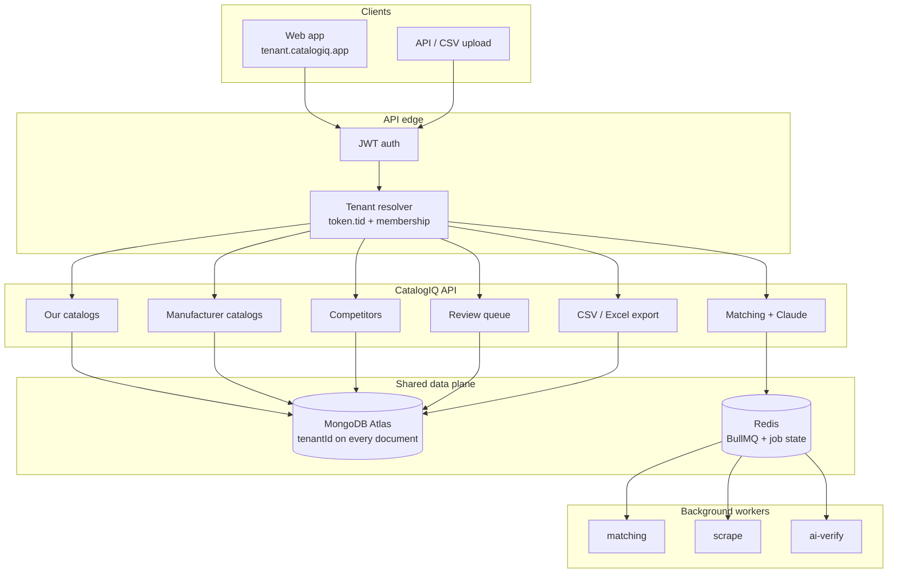
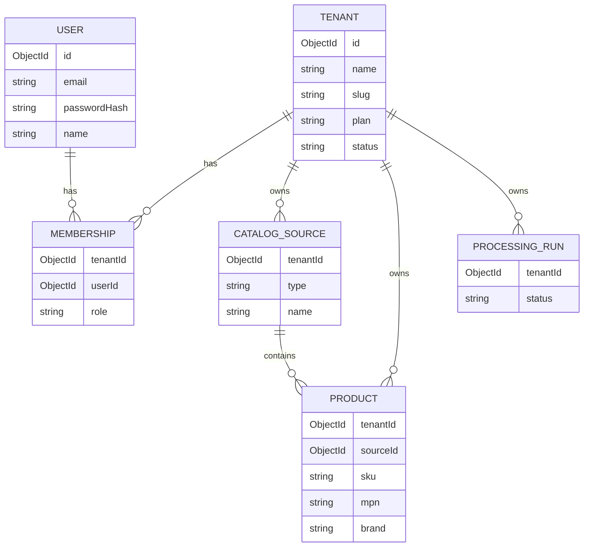
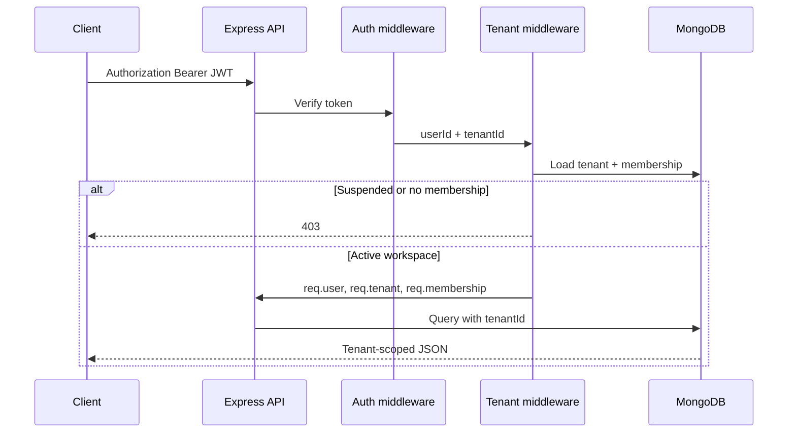
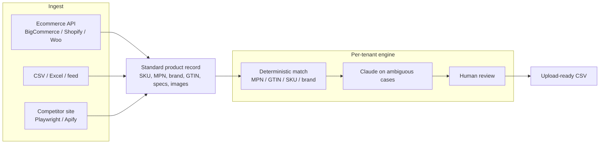

# CatalogIQ

Multi-tenant SaaS for product matching, manufacturer comparison, and competitor intelligence. CatalogIQ ingests catalog, manufacturer, and competitor data into one standard product model, then matches, reviews, and exports upload-ready updates.

Backend folders are in place. Application code is intentionally empty so you can implement each layer.

---

## Project setup

```text
CatalogIQ/
├── Backend/
│   ├── src/
│   │   ├── config/              Env, MongoDB, Redis
│   │   ├── models/              Tenant, User, Membership, Product, sources
│   │   ├── middleware/          Auth, tenant, roles, validation, errors
│   │   ├── routes/              Express routers
│   │   └── utils/               JWT, errors, helpers
│   ├── server.js
│   └── package.json
└── README.md
```

---

## Multi-tenant SaaS model

Every paying customer is a **tenant** (a company workspace). Users belong to one or more tenants through **memberships**. All catalog data lives in a shared MongoDB cluster and is isolated by `tenantId` — the usual starting point for a B2B SaaS launch. High-volume customers can later move to a dedicated database without changing the product model.



### Isolation rules



| Layer | How a tenant is isolated |
| --- | --- |
| Auth | JWT carries `sub` (user) and `tid` (active tenant) |
| Membership | User can act on a tenant only with an active membership |
| Queries | Always filter by `tenantId` |
| Writes | Always stamp `tenantId` from the current workspace |
| Jobs | Queue payloads include `tenantId`; workers never cross tenants |
| Plans | `trial` / `starter` / `growth` / `scale` live on the tenant record |

Roles: `owner`, `admin`, `reviewer`, `member`.

---

## Request path



---

## Product data flow



The matching engine should not depend on a single ecommerce platform. Every source maps into the same internal product shape, then filters by manufacturer and brand so a store with many brands does not compare the whole catalog at once.

---

## Stack

| Area | Choice |
| --- | --- |
| API | Node.js, Express, TypeScript |
| Database | MongoDB (shared cluster, `tenantId` isolation) |
| Cache / jobs | Redis + BullMQ |
| Live progress | Socket.IO |
| Validation | Zod |
| AI | Claude API |
| Browser automation | Playwright / Apify |
| Frontend (planned) | React, TypeScript, Vite, Tailwind, shadcn/ui |
| Deploy | Docker |

---

## Implementation phases

1. **Setup** — fill the folders: auth, tenant isolation, models
2. **Proof of concept** — 50 products, one manufacturer, one competitor
3. **Beta** — matching, scraping, review queue
4. **Scale** — background jobs, cost controls, 2,000+ products
5. **Launch** — billing plans, invites, more sources, scheduled runs
